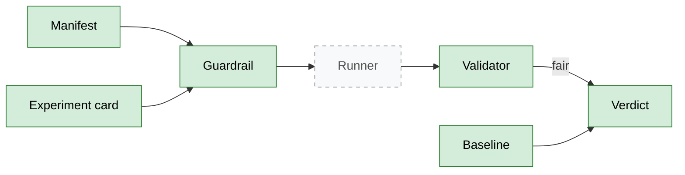
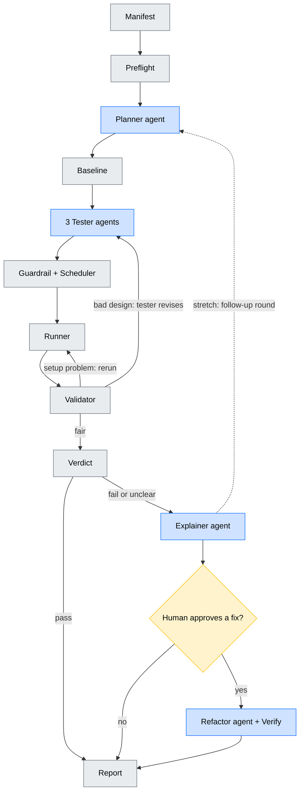

# chaos-swarm

A **multi-agent system** that tries to break a web backend on purpose, inside a throwaway sandbox, then explains what broke and proposes a human-approved fix.

> **Agents propose, code disposes: a test only counts if it was fair.**

| | Agents (LLM) | Plain code |
|---|---|---|
| Do | read code, decide what to test, explain results, write fixes | send traffic, cause failures, measure, apply the rules, decide pass/fail |

An agent never measures and never grades its own work. Nodes share one state and are wired as a graph (LangGraph) with retry loops, human approval gates, and hard budgets so it always stops.

Full design: [docs/architecture_v2.md](docs/architecture_v2.md)

---

## Current graph

Solid = built and tested. Dashed = not built. No agents yet.

## Goal graph

Blue = agent, yellow = human, grey = plain code.

### Nodes

| Node | Role |
|---|---|
| Manifest | The rulebook: how to run the target, how to log in, how hard we may push |
| Preflight | Start the sandbox, fill it with realistic data, check it works |
| Planner | Reads the project, gives each tester a short brief |
| Baseline | Measures normal behaviour, so "slow" means slower than normal |
| Testers (request / database / failure) | Turn a brief into experiment cards (JSON) |
| Guardrail + Scheduler | Reject or shrink cards outside the limits; merge, dedupe, order |
| Runner | Reset, send traffic or cause the failure, record measurements |
| Validator | "Was that a fair test?" |
| Verdict | "Did the backend pass?" |
| Explainer | Explains a failure from a compact evidence summary |
| Refactor + Verify | Proposes a fix on a copy, re-runs the failed experiments to prove it |
| Report | What was tried, what broke, what was **not** covered |

### Edges that matter

| Edge | Meaning |
|---|---|
| Validator → Runner | The setup failed (crash, overloaded machine): rerun the same card |
| Validator → Testers | The card was flawed (wrong login, too little load): send back with the reason |
| Verdict → Explainer | Only failures and unclear results get explained |
| Human gate → Refactor | Only approved problems get a fix |
| Follow-up → Planner | *(stretch)* unclear results trigger a second, different round |

### Inside the boxes (the mechanisms)

- **Validator:** separates a *bad test* from a *failed backend*. A pile of login errors is a bad test, not a fast backend. Out of retries means "could not test", never "pass".
- **Verdict:** compares to the baseline and its normal wobble; a "pass" only counts if the card's *mechanism signal* appeared (proof the load really reached the limit); failures are re-run to confirm.
- **Guardrail:** limits come from the manifest and are enforced in code, never by prompt.
- **Runner / Preflight:** sandbox on an isolated network, reset to a clean copy before every experiment.
- **Verify:** a fix must pass the original experiment, a harder variant, and the app's own tests.

---

## Folders

| Folder | What |
|---|---|
| `swarm/` | The product: graph and its logic. Core logic built |
| `adapters/` | Glue to Docker, the database and the host machine. Empty |
| `manifests/` | One rulebook per target |
| `fixtures/` | Practice backends with planted bugs and healthy controls, so we know the right answers. Empty |
| `evals/` | Scoreboard: runs the swarm on fixtures repeatedly, reports hit and false-alarm rates. Empty |
| `runs/` | Output of each run: cards, measurements, audit log. Git-ignored |
| `tests/` | Unit tests for the core (27 passing) |
| `docs/` | Full architecture |

## Prerequisites

Present: Python 3.12, Git. **Needed:** WSL2 + Docker Desktop (runs the sandbox). Later: an LLM API key. k6, Toxiproxy and Postgres run as Docker images.

## Build order

| Slice | What | Status |
|---|---|---|
| 0a | Cards, manifest, guardrail, validator, verdict | **done** |
| 0b | Sandbox, seeding, runner, real baseline | needs Docker |
| 1 | First agent (request tester) + report | |
| 2 | Scheduler, retry paths | |
| 3 | Explainer | |
| 4 | Database tester | |
| 5 | Failure tester | |
| 6 | Planner + follow-up loop | |
| 7 | Refactor, human gate, verify | |
| 8 | Fixtures + evals (start early if possible) | |

## Dev

    python -m venv .venv
    .venv\Scripts\pip install -e .[dev]
    .venv\Scripts\python -m pytest
