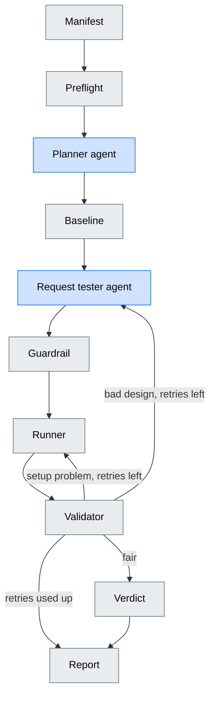
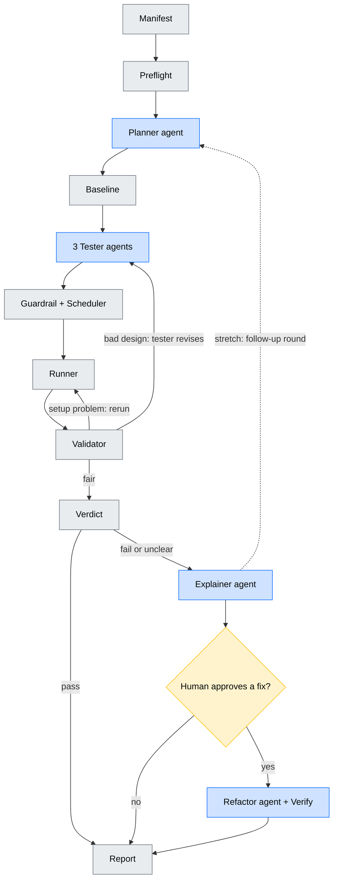

# chaos-swarm

A **multi-agent system** that tries to break a web backend on purpose, inside a throwaway sandbox, then explains what broke and proposes a human-approved fix.

> **Agents propose, code disposes: a test only counts if it was fair.**

| | Agents (LLM) | Plain code |
|---|---|---|
| Do | read code, decide what to test, explain results, write fixes | send traffic, cause failures, measure, apply the rules, decide pass/fail |

An agent never measures and never grades its own work. Nodes share one state and are wired as a graph (LangGraph) with retry loops, human approval gates, and hard budgets so it always stops.

Full design: [docs/architecture_v2.md](docs/architecture_v2.md)

---
## v1 graph (target)

The smallest version that is still a real multi-agent system with LLMs: two agents, one experiment type (a burst of requests), no refactoring. Every run ends in **pass**, **fail**, or **could not test**.

| Node | v1 scope | Status |
|---|---|---|
| Manifest | Hand-written file for the login backend | built |
| Preflight | Start the sandbox, prove it has no internet, seed data, check login, save a clean copy | written, untested against Docker |
| Planner | Reads the OpenAPI spec and picks which endpoints are worth hammering; writes one brief | agent |
| Baseline | Normal-speed runs for the usual wobble, then a ramp to find where the backend starts to struggle (its capacity). The tester asks for load as a multiple of that capacity | maths built, runner needed |
| Request tester | Turns the brief into experiment cards | agent |
| Guardrail | Limits check and API-description check; no scheduling | built |
| Runner | Reset, send the burst, record measurements | needs Docker + k6 |
| Validator | Fair test? Says whether a retry should rerun or redesign | built |
| Verdict | Pass or fail against baseline | built |
| Report | Per experiment: pass / fail / could not test, with numbers | to build |

Out of v1: scheduler, explainer, human gates, database and failure testers, refactor, follow-up rounds.

## Goal graph (later)

Blue = agent, yellow = human, grey = plain code.

### Nodes

| Node | Role |
|---|---|
| Manifest | The rulebook: how to run the target, how to log in, how hard we may push |
| Preflight | Start the sandbox, fill it with realistic data, check it works |
| Planner | Reads the project, gives each tester a short brief |
| Baseline | Measures normal behaviour, so "slow" means slower than normal |
| Testers (request / database / failure) | Turn a brief into experiment cards (JSON) |
| Guardrail + Scheduler | Reject or shrink cards outside the limits; merge, dedupe, order |
| Runner | Reset, send traffic or cause the failure, record measurements |
| Validator | "Was that a fair test?" |
| Verdict | "Did the backend pass?" |
| Explainer | Explains a failure from a compact evidence summary |
| Refactor + Verify | Proposes a fix on a copy, re-runs the failed experiments to prove it |
| Report | What was tried, what broke, what was **not** covered |

### Edges that matter

| Edge | Meaning |
|---|---|
| Validator → Runner | The setup failed (crash, overloaded machine): rerun the same card |
| Validator → Testers | The card was flawed (wrong login, too little load): send back with the reason |
| Verdict → Explainer | Only failures and unclear results get explained |
| Human gate → Refactor | Only approved problems get a fix |
| Follow-up → Planner | *(stretch)* unclear results trigger a second, different round |

### Inside the boxes (the mechanisms)

- **Validator:** separates a *bad test* from a *failed backend*. A pile of login errors is a bad test, not a fast backend. Out of retries means "could not test", never "pass".
- **Verdict:** compares to the baseline and its normal wobble; a "pass" only counts if the card's *mechanism signal* appeared (proof the load really reached the limit); failures are re-run to confirm.
- **Guardrail:** limits come from the manifest and are enforced in code, never by prompt.
- **Runner / Preflight:** sandbox on an isolated network, reset to a clean copy before every experiment.
- **Verify:** a fix must pass the original experiment, a harder variant, and the app's own tests.

---

## Folders

| Folder | What |
|---|---|
| `swarm/` | The product: graph and its logic. Core logic built |
| `adapters/` | Glue to Docker, the database and the host machine. Empty |
| `manifests/` | One rulebook per target |
| `fixtures/` | Practice backends with planted bugs and healthy controls, so we know the right answers. Empty |
| `evals/` | Scoreboard: runs the swarm on fixtures repeatedly, reports hit and false-alarm rates. Empty |
| `runs/` | Output of each run: cards, measurements, audit log. Git-ignored |
| `tests/` | Unit tests for the core (27 passing) |
| `docs/` | Full architecture |

## Prerequisites

Present: Python 3.12, Git. **Needed:** WSL2 + Docker Desktop (runs the sandbox). Later: an LLM API key. k6, Toxiproxy and Postgres run as Docker images.

## Build order

| Slice | What | Status |
|---|---|---|
| 0a | Cards, manifest, guardrail, validator, verdict | **done** |
| 0b | Sandbox, seeding, runner, real baseline | needs Docker |
| 1 | **v1 graph**: planner + request tester agents, report | next |
| 2 | Scheduler, more retry paths | |
| 3 | Explainer | |
| 4 | Database tester | |
| 5 | Failure tester | |
| 6 | Planner + follow-up loop | |
| 7 | Refactor, human gate, verify | |
| 8 | Fixtures + evals (start early if possible) | |

## Manual sandbox testing

Run from the project root with the venv active. Docker Desktop must be running.

The sandbox has no internet and publishes no ports, so you reach it from the inside.

**Launch** (builds, migrates, seeds 50,000 users, takes a clean copy). Success looks like `ok=True` with `isolated`, `login` and `users: 50000`:

    .venv\Scripts\python -c "from swarm.manifest import load_manifest; from swarm.preflight import make_sandbox, run_preflight; m=load_manifest('manifests/deployment_audit.yaml'); print(run_preflight(m, make_sandbox(m)))"

**Look at the database** (`psql` inside the db container):

    docker exec -it chaos_target-db-1 psql -U sandbox -d app

    SELECT count(*) FROM users;                              -- 50000
    SELECT email, role FROM users ORDER BY created_at LIMIT 5;
    \d users                                                 -- columns and indexes
    \q

One-off query without a shell:

    docker exec chaos_target-db-1 psql -U sandbox -d app -tA -c "SELECT role, count(*) FROM users GROUP BY role"

**Send a request** (made from inside the sandbox, returns `(status, body)`):

    .venv\Scripts\python -c "from swarm.manifest import load_manifest; from swarm.preflight import make_sandbox; s=make_sandbox(load_manifest('manifests/deployment_audit.yaml')); print(s.request('POST','http://api:8000/api/login', form={'username':'user0@example.com','password':'sandbox-pass-0'}))"

**Swagger in the browser** (debug only). The forwarder in `docker-compose.debug.yml` is the only container with internet access; the API stays isolated. Start it:

    docker compose -p chaos_target -f fixtures/deployment_audit/docker-compose.yml -f fixtures/deployment_audit/docker-compose.debug.yml up -d proxy

Open <http://127.0.0.1:8000/docs> and use **Authorize**: `user0@example.com` / `sandbox-pass-0`, or `admin0@example.com` / `sandbox-pass-admin` for admin routes. Remove the forwarder when done, and always before a real run:

    docker compose -p chaos_target -f fixtures/deployment_audit/docker-compose.yml -f fixtures/deployment_audit/docker-compose.debug.yml rm -sf proxy

**Reset to the clean copy** (back to 50,000 users in seconds):

    .venv\Scripts\python -c "from swarm.manifest import load_manifest; from swarm.preflight import make_sandbox; make_sandbox(load_manifest('manifests/deployment_audit.yaml')).reset('http://api:8000/health')"

**Tear down** (deletes the containers and data):

    .venv\Scripts\python -c "from swarm.manifest import load_manifest; from swarm.preflight import make_sandbox; make_sandbox(load_manifest('manifests/deployment_audit.yaml')).down()"

## Dev

    python -m venv .venv
    .venv\Scripts\pip install -e .[dev]
    .venv\Scripts\python -m pytest
