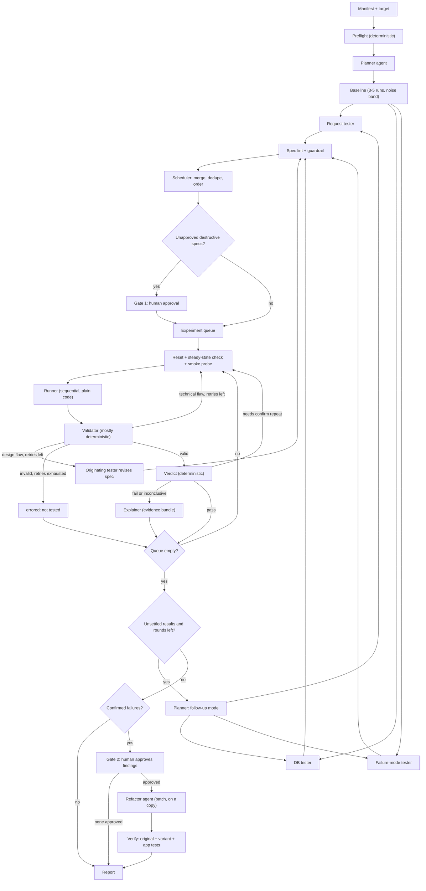

# Chaos Swarm: Architecture Proposal (revised)

A multi-agent system (LangGraph) that stress-tests a backend's resilience, database performance, and failure handling inside a sandbox, then reports measured findings and proposes human-approved fixes.

**Status:** design draft, revision 2. Prior art exists (e.g. ChaosEater, which targets Kubernetes systems), so this project is positioned as a scoped take for small Docker Compose stacks (API + DB), with human-gated experiments and a full audit trail.

## What changed from the previous draft

| Area | Change |
|---|---|
| Graph | Added an **experiment queue** and a per-experiment loop. Verdicts accumulate; refactor runs **once, at the end, on the batch** of confirmed failures |
| Graph | Added a **scheduler** (merge, dedupe, order) between the guardrail and the runner |
| Graph | Added the missing **human gates** (destructive experiments, refactor), a **follow-up loop**, and **budget limits** |
| Outcomes | `inconclusive` split in two: **`errored`** (could not test, never counted as a pass) and **`inconclusive`** (valid run, question unsettled, triggers follow-up) |
| Retries | Two retry paths: **technical flaws** rerun the same spec after a reset (no LLM); **design flaws** go back to the originating tester with the reason |
| Validity | Specs declare **expected stimulus** and **mechanism signals**, so a "pass" at a load that never stressed anything can't count |
| Judging | Verdicts are **relative to baseline and its noise band**, with absolute SLOs optional; validator checks the **whole host**, not only the load generator |
| New node | **Explainer (analyst)** produces the "why" from a compact **evidence bundle** |
| Manifest | Added **seed plan**, **`test_command`**, **budgets**, **resource pinning**, **network allowlist** |
| Refactor | Verification adds the app's own tests, a held-out variant, and limits on what the agent may touch |
| Isolation | Enforced at the **network level**, not only by convention |
| Evals | Fixtures directory with planted flaws **plus healthy controls**, each run several times |
| Build order | Added a **slice 0 with no LLM**, to learn what real measurements look like first |

---

## 1. Core principles

1. **LLMs decide and interpret; deterministic code attacks and judges.** Agents plan and explain. Load generation, fault injection, thresholds, and verdicts are plain code.
2. **Separate "was the test valid?" from "did the system pass?"** A broken test must never be reported as a system failure, and a test that never stressed the system must never be reported as a pass.
3. **The manifest is a safety contract.** Every experiment must fit inside it, enforced in code, not by prompt.
4. **Never touch the real thing.** Everything runs in a sandbox. Refactors apply to a copy of the target, never the user's repo.
5. **Every claim cites a measurement.** No number, no finding. Root causes are hypotheses until confirmed by an isolating experiment or a verified fix.
6. **Treat the target's code as untrusted input.** Comments or docs in a repo can try to steer an agent.
7. **Judge relative to baseline.** Sandbox hardware is noisy. Results are compared to the measured baseline and its noise band; absolute thresholds are secondary.
8. **Isolation is enforced by infrastructure.** Network rules and allowlists, not promises in a prompt.

---

## 2. Project layout

The swarm lives in its own repository, separate from the system it tests.

```
chaos-swarm/                  # this project
  swarm/
    state.py                  # graph state schema
    graph.py                  # builds and compiles the StateGraph
    nodes/                    # preflight, planner, baseline, testers, scheduler,
                              #   validator, verdict, explainer, gates, refactor, report
    tools/                    # LLM-facing wrappers (@tool): jailed file read, OpenAPI, schema, metrics
    runner/                   # deterministic executor (k6 script generation, fault injection)
    evidence.py               # builds the per-experiment evidence bundle
    guardrail.py              # spec lint + manifest envelope checks
    verdict.py                # deterministic pass/fail math (baseline-relative)
  adapters/                   # sandbox, Docker, DB seed/snapshot/restore, host metrics
  manifests/                  # one manifest per target
  fixtures/                   # practice targets: planted-flaw apps, healthy controls
  evals/                      # eval harness: runs fixtures N times, reports rates
  runs/                       # per-run artifacts: specs, raw results, evidence, audit log (JSONL)
  api/                        # optional, later: FastAPI wrapper to launch/inspect runs

deployment-audit-project/     # test subject #1 (the existing FastAPI backend)
```

**Test subject #1:** the existing FastAPI + Postgres auth backend, run in the sandbox via its own `docker-compose.yml`. Keep **planted-flaw variants** (missing index, tiny connection pool, N+1 query, no timeout on a dependency) and **healthy controls** under `fixtures/` so evals are scriptable.

---

## 3. The manifest (input contract)

One file per target. It tells the swarm how to run the target and how far it may go.

| Section | Contents |
|---|---|
| **Target** | compose file path, service names (api, db), health endpoint, base URL, code path (read by the planner and refactor agent) |
| **Auth strategy** | how to register and log in (e.g. `POST /api/register` JSON, `POST /api/login` form-encoded, bearer token), seed users and roles |
| **Seed plan** | how to fill the DB and with how many rows per table (a missing index only shows up at realistic volume). Prefer direct inserts with a precomputed password hash over registering users through the API (bcrypt would turn setup into a load test) |
| **DB access** | connection details for inspection, schema introspection allowed, safe query rules |
| **Destruction envelope** | max RPS, max duration, max concurrency, allowed fault types (latency, kill container, pause DB, connection exhaustion), forbidden actions, target allowlist |
| **SLOs** | pass/fail rules per endpoint class, expressed **relative to baseline** (e.g. p95 more than 2x baseline and outside the noise band) with optional absolute ceilings |
| **App tests** | `test_command`, how to run the target's own test suite (used as a gate for refactors) |
| **Resources** | CPU/memory limits per container and core pinning, so the load generator and the target don't compete |
| **Budgets** | max experiments per run, max retries, max follow-up rounds, wall-clock limit, LLM cost cap |
| **Approval rules** | which actions need human approval (all destructive faults, every refactor) |

For the current backend, the auth section would describe the form-encoded login and 8+ character passwords.

**Authoring:** hand-write the manifest for your own app first to learn which fields matter. Seed plan, start command, env vars, and auth can be auto-discovered later (from OpenAPI, Alembic migrations, and settings classes), shrinking the required input to a target path with everything else an override.

---

## 4. Graph flow



Notes on the diagram:
- The invalid-retry edge for design flaws returns to the **originating** tester (shown generically as one node).
- Specs already approved at Gate 1 skip the gate when they re-enter after a revision, unless the change makes them destructive in a new way.
- Follow-up rounds re-enter at the planner and **reuse the stored baseline**.
- Every transition and every approval is written to the audit log.

---

## 5. Stages

### 5.1 Preflight (deterministic)
Checks before anything is planned:
- compose stack starts on an **internal Docker network**, health endpoint is green
- DB reachable, migrations applied, **seed plan executed**, row counts match
- manifest auth works end to end, tokens obtained
- a **master copy of the seeded DB** is saved (used for fast resets)
- the host has enough free CPU and memory for the planned load

If this fails, the run aborts early with a clear reason.

### 5.2 Planner agent
Analyzes the target and assigns work to the three testers. Gives it **deterministic tools first**, instead of making it read the whole repo:
- the OpenAPI spec (FastAPI exposes it)
- Postgres schema introspection, `EXPLAIN`, `pg_stat_statements`
- targeted, jailed file reads only where needed (read-only, size-limited)

Output: a structured plan, including a **brief per tester**: the endpoints, queries, and file slices relevant to that tester, with the suspected risks and a rationale. Each tester sees its brief rather than the whole repo, and keeps a read-only grep/read fallback in case the planner missed something.

The planner is invoked again in **follow-up mode** when results are unsettled (see 5.12).

### 5.3 Baseline measurement
Runs **after the planner** (it needs the identified endpoints and queries) and **before the testers** (they need it to calibrate load).
- Normal-rate load with a warmup period.
- Repeated **3 to 5 times** to get a median and a **noise band**, not a single number.
- If the spread is large, extend the runs or mark the environment `noisy` and widen the band. Don't tighten thresholds to compensate.
- Stored in state as a compact summary; raw data goes to files in `runs/`.

### 5.4 Testers (fan-out, parallel generation)
Three agents produce **structured test specs**, not code:
- **Request tester:** endpoint, payload template, concurrency, duration, ramp profile
- **DB tester:** query patterns, contention scenarios, slow-query probes
- **Failure-mode tester:** latency injection, container kill/pause, connection exhaustion

Each spec carries the fields the validator and verdict need:

```json
{
  "id": "login-burst-01",
  "hypothesis": "POST /api/login p95 degrades at 30 concurrent users",
  "type": "load",
  "steps": [{"endpoint": "/api/login", "vus": 30, "duration_s": 60}],
  "abort_if": {"error_rate_above": 0.5},
  "expected_stimulus": {"min_achieved_vus": 27, "min_duration_s": 55, "expected_status": [200]},
  "mechanism_signals": [{"metric": "db_active_connections", "op": ">=", "value": 15}],
  "fail_if": {"p95_vs_baseline_above": 2.0}
}
```

- **`expected_stimulus`** lets the validator confirm the test actually ran as designed.
- **`mechanism_signals`** declare what should be observable if the hypothesis is really being exercised (here, 15 is the SQLAlchemy default pool of 5 plus 10 overflow). If they never appear, a pass is not trusted.
- **`fail_if`** is baseline-relative; thresholds come from the manifest, never invented by the tester.

Generation is parallel. Execution is not (see 5.8).

**Spec expressiveness:** version 1 is a single endpoint plus auth. Version 2 adds multi-step flows with values captured between steps (create, read id, update), compiled to load scripts by plain code. Agents never write raw load-test scripts, since they can't be validated reliably. Decide the schema early, because the tester prompts depend on it.

**Implementation note:** the three testers can start as one prompt template parameterized by tester type and brief, and split into separate prompts or agents only if evals show a quality gain.

### 5.5 Spec lint and guardrail (deterministic)
Lint each spec: the endpoint exists in the OpenAPI spec, payloads validate against the schema, a pass/fail rule and mechanism signals are present. Then check the **manifest envelope**: RPS and duration caps, allowed fault types, target allowlist. Out-of-bounds specs are rejected or clamped. A spec with fixable lint errors gets **one repair pass** back to its tester, then is dropped and listed as "not run". This holds even if a tester misbehaves.

### 5.6 Scheduler (deterministic)
Merges specs from the three testers, removes duplicates (by parameter hash), and orders the queue: **non-destructive first, destructive last**, with a stack reset between experiments. Enforces the total experiment budget. The runner never sees three overlapping lists in arbitrary order.

### 5.7 Human gate 1: destructive experiments
Only if the manifest allows destructive faults. Each destructive spec is shown and approved or skipped. A skipped spec is reported as "not run (declined)" and the run continues. Implemented as a dedicated node using `interrupt()` with no side effects before it. The sandbox is torn down while waiting and rebuilt on resume.

### 5.8 Runner (plain code, not an agent)
Executes specs with real tools (k6 scripts generated from the spec, Toxiproxy, Docker commands):
- **Sequential execution.** Concurrent load and DB tests interfere with each other and confound results.
- **Before every experiment:** reset state (clone the master DB copy, restart the app so its pool isn't holding stale connections), check the target is back to steady state, then send a **smoke probe** (one real request per endpoint, expected status). A failed probe retries the reset once, then marks the experiment `errored`.
- **During:** sample app, DB, container, and **host** metrics; enforce `abort_if`.
- Pin the load generator and the target to separate cores.
- Every action is written to the audit log.

### 5.9 Validator
Decides whether the **test itself** was sound. Mostly deterministic checks, run on facts the runner collected:

- **Hard invalid:** tool crash with no usable results; metrics missing beyond a tolerance; the fault was not confirmed applied; the load generator or the **whole host** was saturated (high CPU, low memory, swapping); an unexpected burst of 401/403/404/409/422 responses (bad credentials, bad payloads, or leftover state: the test measured nothing).
- **Valid even if ugly:** 5xx responses and timeouts (that is target behavior); low achieved concurrency while the generator is healthy (the target is the limit); an `abort_if` triggered by a target metric (the guardrail working, a truncated but valid run).
- **Flagged, not decided by code:** `mechanism_signals` that never appeared, and design questions only judgement can answer. The LLM is used only for these ambiguous cases.

Outcomes:
- **valid:** continue to verdict.
- **invalid, technical flaw** (crash, missing metric, starved host): reset and **rerun the same spec**, no LLM call.
- **invalid, design flaw** (wrong payload, wrong stimulus, load too small): back to the **originating tester** with the reason, so the revised spec is a fix, not a blind repeat.
- **errored:** retries exhausted. Reported as "could not test", **never counted as a pass**.

### 5.10 Verdict (deterministic)
Plain arithmetic on a **valid** run:
- **fail** only when a result is past an absolute SLO, **or** clearly worse than baseline **and** outside the noise band.
- **pass** only if all rules are met **and** the declared mechanism signals were observed. A clean result without the signals is **inconclusive (weak pass)**, because the stimulus may never have reached the limit.
- A result inside the noise band is **inconclusive**, never a fail.
- **Confirmation repeats:** a clear fail is repeated once; if both fail it is confirmed, if they disagree it becomes inconclusive (unstable). A borderline result (within about 20% of the threshold, or inside the noise band) gets 3 runs and uses the median. Start with a fixed single repeat and add the adaptive rule once you have real timing data.

Final outcomes per experiment: **valid-pass**, **valid-fail (confirmed)**, **inconclusive**, **errored**.

### 5.11 Explainer (analyst)
Runs for `fail` and `inconclusive` results, after the deterministic verdict. The LLM explains *why*; it does not decide *whether*. It reads an **evidence bundle** built by plain code, not raw data:

| Item | Purpose |
|---|---|
| Summary stats | percentiles, error counts by status |
| A few time series | key metrics in time buckets |
| Query deltas | top queries by time from `pg_stat_statements`, before vs after |
| DB state | connection states (`pg_stat_activity`), lock waits (`pg_locks`) |
| Error logs | deduplicated, with counts |
| Container and host stats | CPU, memory per container and for the host |
| Event timeline | "fault applied at t=30s", aligned to the metrics |

Rules: every root-cause claim must cite items in the bundle; causes are stated as **hypotheses** until confirmed by an isolating follow-up experiment or a verified fix; the explainer can call a tool like `get_metric_series(name, window)` to drill down but never receives the whole raw data. Per-request tracing (DB time vs app time) is a good later addition.

### 5.12 Follow-up loop
After the queue is empty: if any results are `inconclusive`, or a confirmed failure has no explained cause, the planner re-enters in follow-up mode with the verdicts and evidence. It must propose **materially different** specs (stronger stimulus, longer duration, another endpoint, or isolation to attribute the cause). Specs identical to earlier ones (by parameter hash) are rejected. Bounded by the follow-up round limit.

### 5.13 Refactor loop (human in the loop)
Runs **once**, on the **batch** of confirmed failures (one fix often explains several failures, and separate refactors can conflict).

Preconditions, all required: a confirmed failure, human approval for that finding at Gate 2, supporting evidence, and a candidate cause inside the code or config in scope. Infrastructure causes ("needs a bigger database") and unexplained or flaky failures get a **written recommendation only**.

Process:
1. **Gate 2:** `interrupt()` shows the findings and evidence. The human approves **per finding** and can attach notes ("don't touch pool settings"). The sandbox is torn down while waiting.
2. The refactor agent works on a **separate copy** (git worktree). It has a narrow toolset: read files, edit inside the worktree, run `test_command` in a no-network container with resource limits. No general shell. It may **not** edit tests, the manifest, or thresholds, and the change has a size cap.
3. The stack is rebuilt from the copy. **Verification** requires all of:
   - the original failing experiments now pass,
   - a **held-out variant** also passes (e.g. +50% load, or different data),
   - the target's own tests (`test_command`) pass,
   - previously passing experiments still pass,
   - the mechanism signal is gone or reduced.
4. Watch for patches that hide the symptom: adding a cache, removing validation, raising a limit, swallowing errors. The human reviews the final diff and its before/after evidence.
5. Two attempts per finding, with verification results fed back. After that: "proposed, unverified".

If the target has no test suite, skip that gate and say in the report that confidence is lower.

### 5.14 Report
Findings, each with its measured numbers, baseline comparison, evidence references, root-cause hypothesis, and audit trail. Findings without a cited measurement are dropped. The overall label is:
- **Clean:** every experiment passed with signals observed.
- **Incomplete:** some experiments errored, were declined, or stayed inconclusive; no confirmed failures.
- **Findings:** at least one confirmed failure.

Reports are marked **truncated** if a budget ran out. They always list **what was tested, at what load, and what was not covered**, because a clean result only means the hypotheses tried were fine.

---

## 6. State (sketch)

Keep state small. Large data lives in files; state holds paths and summaries.

| Field | Purpose |
|---|---|
| `manifest` | parsed manifest (envelope, SLOs, auth, seed, budgets) |
| `plan` | planner output, including per-tester briefs |
| `baseline` | median, noise band, environment flag, path to raw data |
| `test_specs` | specs per tester (reducer: append) |
| `queue`, `cursor` | ordered experiment ids and the current position |
| `results` | per-experiment result summaries (reducer: append) |
| `evidence_paths` | per-experiment path to the evidence bundle |
| `validity` | per-experiment validity, reason, flaw type (technical or design) |
| `retry_counts` | **per experiment**, split by technical and design retries |
| `verdicts` | per-experiment outcome (pass, fail-confirmed, inconclusive, errored) |
| `followup_round` | counter for the follow-up loop |
| `approvals` | Gate 1 decisions and Gate 2 `approved_ids` with notes |
| `patches` | proposed, approved, applied, and verified refactors |
| `budget` | experiments run, wall-clock used, LLM cost used |
| `audit_log_path` | pointer to the append-only audit log |

Reducers matter here: results and specs accumulate across loops instead of overwriting.

---

## 7. Limits and routing rules (starting defaults)

| Rule | Default |
|---|---|
| Baseline runs | 3 to 5 |
| Attempts per experiment (technical and design combined) | 3; stop early if the same reason repeats |
| Confirm repeats for a clear fail | 1 (3 runs for borderline) |
| Follow-up rounds | 2 |
| Spec repair passes | 1 |
| Environment reset attempts | 2, then halt |
| Patch attempts per finding | 2 |
| Max experiments per run | 30 |
| Host overload line | about 80 to 85% CPU, or any swapping |
| Budgets | wall-clock limit and LLM cost cap, set in the manifest |

**End conditions:** (1) normal finish: queue empty, follow-ups done or exhausted, and either no confirmed failures, no approved refactor, or refactor and verification complete; (2) budget exhausted: finish the current experiment, skip the rest, mark the report truncated; (3) unrecoverable environment: tear down immediately, write a partial report; (4) user cancel: tear down and checkpoint.

**Routing is plain code** reading the validator and verdict outcomes. The explainer can influence retries (suggesting adjustments) and follow-ups, but never overrides a threshold on a valid run, and its judgement that a run was invalid discards that run's verdict.

---

## 8. Safety model

- **Sandbox only:** targets are containers the swarm started itself, on an **internal Docker network** with no internet. Images are built beforehand, containers run without network egress.
- **Allowlist enforced in the runner:** only hosts derived from the manifest are reachable. Spec lint rejects anything else.
- The fault proxy's control port is reachable only inside the sandbox network.
- **No LLM keys or other secrets inside the sandbox.** Real `.env` files are never copied in; use generated sandbox values.
- No raw shell access for agents. The refactor agent's code execution is sandboxed (no network, CPU and memory limits).
- Manifest envelope enforced in code (guardrail node), plus a global kill switch.
- Human approval before destructive faults and before any refactor.
- Target code and docs treated as untrusted (prompt-injection risk).
- Thresholds come from the manifest, never from an agent.
- Full audit trail: what was planned, what ran, who approved it, what changed.

---

## 9. What the current backend gives the swarm

Concrete, realistic targets already present in the test subject:
- `POST /api/register` and `POST /api/login`: bcrypt hashing is CPU-heavy, so these degrade early under load. Seed users by direct insert with a precomputed hash, then log in once for tokens.
- Every authenticated request runs a DB lookup (`get_current_user`), a natural contention point.
- `GET /api/admin/users`: pagination behavior under a large table.
- Users table: only the email unique index exists, so other query patterns are candidates for `EXPLAIN` analysis (which needs realistic row counts from the seed plan).
- The engine uses SQLAlchemy defaults (pool of 5 plus 10 overflow, no timeouts), so pool exhaustion and hanging requests are likely early findings.
- The health endpoint doesn't exercise the DB, so it would stay green with Postgres down, which matters for steady-state checks and failure-mode experiments.
- DB container failure and slowdown: how the API behaves with a dead or slow Postgres (connection handling, timeouts, error responses).
- There is no automated test suite yet. Write a pytest suite for the backend before the refactor verification step, since it is the gate that catches overfitted fixes.

---

## 10. Fixtures and evals

Under `fixtures/`, keep practice targets with known ground truth:

| Fixture | Tells you |
|---|---|
| Planted flaws (tiny pool, missing index, N+1 query, no timeouts) | **Recall:** does the swarm find each one? |
| **Healthy control** | **False positives:** does it correctly report Clean? |
| **Healthy but noisy** variant | Does baseline and noise-band handling work? |
| **Sabotaged runs** (wrong credentials, starved load generator, aborted run) | Does the validator and explainer label them invalid, not failures? |

Also measure **scope recall**: did the planner's brief for each tester include the file containing the planted flaw? That separates planner failures from tester failures.

Run each fixture about **5 times** and report rates (recall, false-positive rate, flakiness), since LLM output varies. Trace every LLM call (Langfuse or LangSmith) and save prompts and responses under `runs/`.

---

## 11. Suggested build order (vertical slices)

0. **No LLM at all.** Compose, preflight and seeding, a **hand-written spec JSON**, guardrail, k6 runner, validator, verdict, against your own backend. Run the baseline 5 times and see how much your machine wobbles. Everything after this works on real numbers.
1. Thin end-to-end with one LLM node: the request tester generating specs, plus the report.
2. Experiment queue, scheduler, and the retry paths (technical and design).
3. Explainer with the evidence bundle.
4. DB tester.
5. Failure-mode tester (needs sandbox control and state reset), plus Gate 1.
6. Planner with deterministic tools and per-tester briefs; follow-up loop.
7. Refactor loop: Gate 2, worktree, verification with variant and app tests.
8. Planted-flaw fixtures, healthy controls, and the eval harness (start these earlier if possible, since they validate every slice).

Optional later: manifest auto-discovery (start command, env vars, seed, auth from OpenAPI and migrations), multi-step spec DSL, adaptive confirm repeats, template-database resets, request tracing, an API wrapper, Git/Kubernetes adapters.

---

## 12. Decisions and open questions

**Decided**

| Question | Decision |
|---|---|
| Load tool | **k6**, with scripts generated from specs by plain code; the runner wraps the CLI and its JSON summary |
| Reset between experiments | Start by **recreating containers and re-seeding**; move to a **Postgres template database** (terminate connections, restart the app after each clone) when reset time hurts |
| Audit log | **JSONL files** per run under `runs/`; a DB table later if querying is needed |
| LLM tracing | Langfuse or LangSmith from the first LLM node, plus saved prompts and responses |
| Baseline repetitions | **3 to 5** short runs; extend or mark noisy if the spread is large |

**Still open**
- Which LLM provider and model for each agent.
- Default SLO rules for the manifest (for example "2x baseline").
- How expressive the spec schema gets in version 2 (multi-step flows).
- When to switch from container recreation to template-database resets.
- Whether to implement the three testers as one parameterized node or three prompts from the start.
